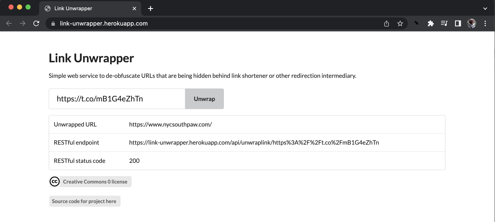
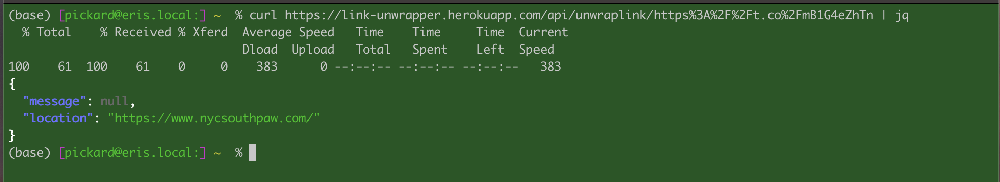

# Link unwrapper

[](https://heroku.com/deploy)

Web service to get the URL of links that are obscured by intermediary ad tracking tools such as 'shorteners'. 

Link intermediaries are used by ad companies to track you by acting as middle men between URLs. They provide no value to the consumer of the link (you) and create bloat, delay and security threats by hiding the actual location of a link.

Link Unwrapper is a simple web service with only one API endpoint that takes in a URL from a link shortener and returns the actual URL. The service does no tracking, keeps no records of who requested what link to be unwrapped. It does keep a tempory cache of shortend to full links for effiencey but no user data is stored in the cache. 

This version is intented to run on Heroku. The web service can be run locally for testing but that is likely to expose your IP to the URL shortener service which may weaken the ad tracking protections of Link Unwrapper. Running in the cloud means the unrwapping will be done from a differnet IP (the cloud service's) than the shortened URL was served to (your IP). Getting a running instance on Heroku is pretty easy with github integration. So you can run your own instance.

Ad tech is intentionally opaque so it is not clear to me how much of an impact link unwrapping will have on privacy preservation. This is an experiment.

#### Example GUI in Heroku


#### Example command line to RESTful endpoint


## Usage
Simple HTTP GET to the RESTful endpoint /api/unwraplink/[URL encoded shortened link]. For example to unwrap the link `https://t.co/mB1G4eZhTn` the REST HTTP GET to the host `link-unwrapper.heokuapp.com` would be

```
 curl https://link-unwrapper.herokuapp.com/api/unwraplink/https%3A%2F%2Ft.co%2FmB1sdfsd
```

The REST call will respond with the following status codes
- __404__ if the _wrapped_ URL returned a 404
- __412__ if the GET request to the _wrapped_ URL did not respond with a redirect status code of 301, 302, 303, 307 or 308
- __417__ if the response to the GET _wrapped_ URL did not include a `location` header
- __200__ if the _wrapped_ URL was a redirect and had a location header

The body of the response will be a json document in the format 

```
{
    "message": "some message",
    "location": "unwrapped URL value or NONE in case of an err"
}
```

## Next work

Make a Firefox plugin that alters pages to unwrap detected shortened URLs

## Things I don't know

- Do Twitter shortened links expire?
- Are all Twitter shortened links the same for all users?
- Other link shortener services